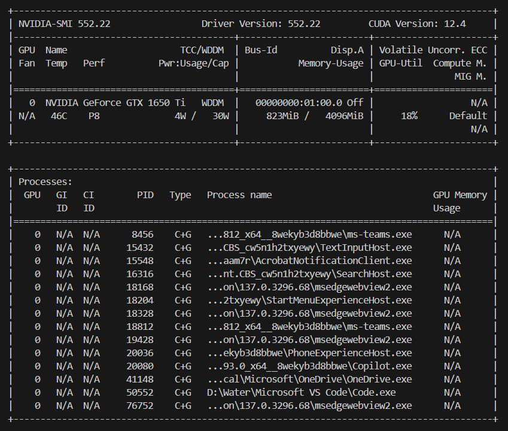

# Fine-Tuning Process for `distilbert-base-uncased` on AG News Dataset

### Load Pre-trained Model

The `distilbert-base-uncased` model was loaded from the Hugging Face transformer library.

## Model Choice: `distilbert-base-uncased`

- **Efficiency**: DistilBERT model is a smaller and faster version of BERT model that maintains 97% of its performance. So it will take take less time for training and inference.
- **Model Train on English text**: It is trained on uncased English corpora, which aligns with the AG News dataset.

Model loaded in model.py file:

```python
model = AutoModelForSequenceClassification.from_pretrained("distilbert-base-uncased", num_labels=4)
```
- The num_labels=4 indicating the unique labels in the AG News dataset.


### Tokenization

The AG News dataset tokenized with the `distilbert-base-uncased` model tokenizer for this we are using hugging face transformer library `from transformers import AutoTokenizer`. 
This step converts raw text into numerical token IDs. Padding and truncation were applied to ensure uniform input size, with a maximum sequence length of 512.

### Data convert to PyTorch tensors

The tokenized datasets converted into PyTorch tensors and wrapped into DataLoader objects to efficiently batch and feed data to the GPU during training.

### Training Loop

The model was trained for **4 epochs**. In each epoch:

- The model processed the entire training dataset.
- The loss was computed to measure prediction error.
- The **Adam optimizer** (with learning rate `2e-5`) updated model weights to minimize the loss.

- For getting good learning rate and batch size we have take some idea from this site - `https://datascience.stackexchange.com/questions/64583/what-are-the-good-parameter-ranges-for-bert-hyperparameters-while-finetuning-it`


## Batch Size of 8

A **batch size of 8** we selected because NVIDIA GeForce GTX 1650 Ti GPU with **4GB of VRAM**. 

- Here is GPU Information 

During training GPU stored the model weight, gradients, optimizer state and current batch data in memory. IF a used big batch size we may get the Cuda out-off memory error. 


