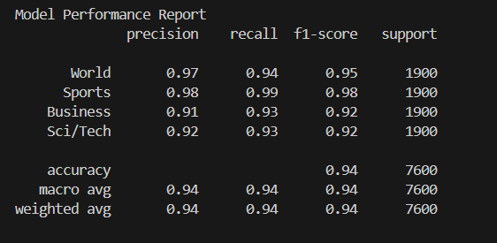

# 📝 Model Performance Report

### Model: `distilbert-base-uncased`
### Dataset: AG News

---

## Overview

Performance of a fine-tuned `distilbert-base-uncased` model on the AG News dataset. The dataset includes four balanced categories: **World**, **Sports**, **Business**, and **Sci/Tech**. The model was trained for text classification and evaluated on test dataset.

---

## Classification Metrics

| Category   | Precision | Recall | F1-Score | Support |
|------------|-----------|--------|----------|---------|
| World      | 0.97      | 0.94   | 0.95     | 1900    |
| Sports     | 0.98      | 0.99   | 0.98     | 1900    |
| Business   | 0.91      | 0.93   | 0.92     | 1900    |
| Sci/Tech   | 0.92      | 0.93   | 0.92     | 1900    |

---

### 🔢 Overall Performance

- **Accuracy**: 0.94  
- **Macro Average**:  
  - Precision: 0.94  
  - Recall: 0.94  
  - F1-Score: 0.94  
- **Weighted Average**:  
  - Precision: 0.94  
  - Recall: 0.94  
  - F1-Score: 0.94  
---

## Observations

- The model performs **very well overall**, especially in the **Sports** and **World** categories.
- Slightly lower precision in the **Business** and **Sci/Tech** categories suggests some room for improvement.
- The dataset is well balanced, so both macro and weighted averages are equal in this case.
- High and balanced precision, recall, and F1-scores across classes indicate strong generalization.

---

## Future Work

1. **Can try Powerful Model**  
   Used the larger model like **BERT-base** or **RoBERTa-base** to improve contextual understanding but need to carefull about the availabel VRAM if trained on the GPU and also this large models will take take more time to trained but it's depends on available hardware resources.

2. **Tune Hyperparameters**  
   Fine-tune learning rate, batch size, or number of training epochs to achieve better convergence.

---

